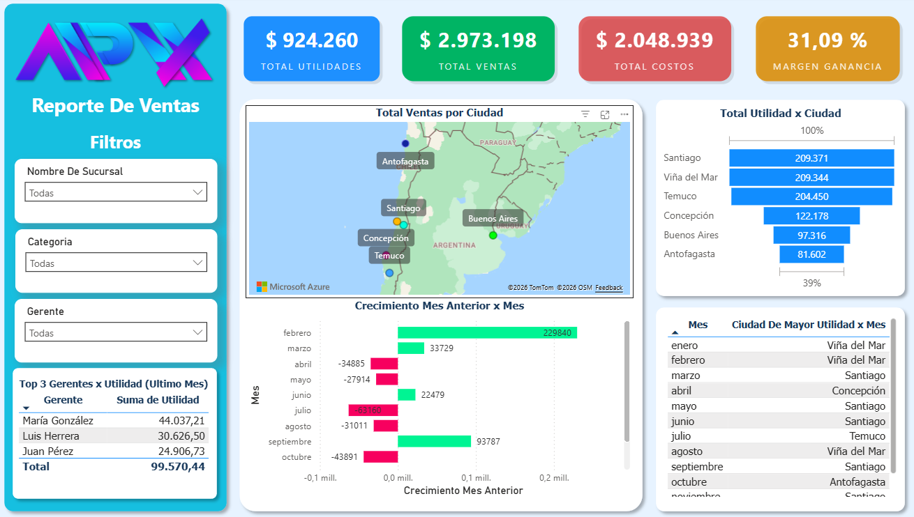

# 📊 Pipeline de Datos: Power BI + MySQL + Python

## Vista previa del Dashboard



---

Pipeline end-to-end para análisis de ventas y costos: ingesta automatizada de datos con Python, almacenamiento en MySQL y visualización en Power BI.

---

## 🗂️ Estructura del proyecto

```
powerbi-mysql-pipeline/
│
├── data/
│   ├── nuevas_sucursales.csv      # Datos de nuevas sucursales
│   ├── nuevas_ventas.csv          # Registros de ventas nuevas
│   ├── nuevos_costos.csv          # Registros de costos nuevos
│   └── nuevos_productos.csv       # Catálogo de productos nuevos
│
├── sql/
│   ├── ventas_costos.sql          # Script de creación de la BD y tablas
│   └── revision_datos.sql         # Consultas de validación y análisis
│
├── python/
│   └── insertar_nuevos_datos.py   # Algoritmo de inserción automática CSV → MySQL
│
├── Proyecto_Final.pbix            # Dashboard Power BI (conectado a MySQL)
└── README.md
```

---

## ⚙️ ¿Cómo funciona el pipeline?

```
Archivos CSV
     │
     ▼
insertar_nuevos_datos.py  ──→  Base de datos MySQL (ventas_costos)
                                        │
                          revision_datos.sql (validación)
                                        │
                                        ▼
                               Power BI Dashboard
                          (conexión directa a MySQL)
```

### Paso 1 — Crear la base de datos
Ejecuta `ventas_costos.sql` en MySQL Workbench o tu cliente SQL preferido. Esto crea la base de datos `ventas_costos` con las tablas: `sucursales`, `productos`, `ventas`, `costos`.

### Paso 2 — Insertar nuevos datos con Python
El script `insertar_nuevos_datos.py` lee los archivos CSV y los carga directamente en MySQL usando `INSERT ... ON DUPLICATE KEY UPDATE`, lo que garantiza que no se sobrescriban registros existentes ni se generen duplicados.

```bash
# Instalar dependencias
pip install pandas mysql-connector-python

# Ejecutar el script
python insertar_nuevos_datos.py
```

> ⚠️ Antes de ejecutar, configura tus credenciales de MySQL en el script:
> ```python
> conn = mysql.connector.connect(
>     host="localhost",
>     user="tu_usuario",
>     password="tu_contraseña",
>     database="ventas_costos"
> )
> ```

### Paso 3 — Validar los datos con SQL
Ejecuta `revision_datos.sql` para verificar la integridad de la información cargada. Incluye consultas para:
- Conteo de registros por tabla
- Top 5 productos más vendidos
- Ingresos y costos por sucursal
- **Utilidad por sucursal** (Ingresos − Costos)

### Paso 4 — Visualizar en Power BI
Abre `Proyecto_Final.pbix`. El dashboard se conecta directamente a la base de datos MySQL y refleja los datos más recientes de forma automática.

---

## 🗃️ Tablas en la base de datos

| Tabla | Descripción | Campos clave |
|---|---|---|
| `sucursales` | Información de cada sucursal | id_sucursal, ciudad, región, gerente |
| `productos` | Catálogo de productos | id_producto, categoría, precio_venta, costo_unitario |
| `ventas` | Transacciones de venta | id_venta, id_sucursal, id_producto, fecha, total_venta |
| `costos` | Registros de costos | id_costo, id_sucursal, id_producto, fecha, total_costo |

---

## 📦 Dependencias

```
pandas
mysql-connector-python
Power BI Desktop (para el archivo .pbix)
MySQL 8.0+
```

---

## 💡 Habilidades demostradas

- Diseño de base de datos relacional (MySQL)
- ETL con Python: extracción desde CSV, transformación y carga a BD
- Prevención de duplicados con `ON DUPLICATE KEY UPDATE`
- Validación de integridad con SQL (JOINs, agregaciones, subqueries)
- Conexión de Power BI a fuente de datos MySQL en tiempo real
- Automatización de pipeline de datos end-to-end
